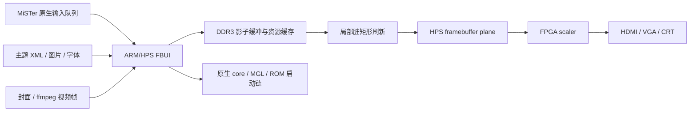

# MISTER_FBUI

> **实验性项目 / Experimental**
> 本项目仍处于快速研发阶段，可能出现花屏、布局越界、视频预览卡顿、主题不兼容或模式切换失败。请务必备份 SD 卡根目录中的原版 `MiSTer`，不要将当前版本视为稳定发行版。

MISTER_FBUI 是基于 MiSTer 主程序的实验性全屏图形前端。目标是在不修改 FPGA HDL、也不移植完整 EmulationStation 的前提下，利用 DE10-Nano 的 ARM/HPS、板载 DDR3 和 MiSTer 已有的 framebuffer/scaler 通路，实现：

- 全屏主题菜单、系统背景、Logo、封面与视频缩略图；
- 可动态显示游戏名和目录名的中文字体；
- EmulationStation/Batocera 主题的轻量兼容；
- 240P CRT 与高清 HDMI 菜单模式；
- 保留 MiSTer 原生输入、核心启动、MGL 和 ROM 挂载流程。

## 核心思路

传统 MiSTer 菜单主要由 FPGA OSD 绘制，稳定且延迟低，但颜色、字体、图片和布局能力有限。本项目把复杂界面交给 ARM/HPS：先在普通缓存内存中完成软件绘制，再把变化区域写入 MiSTer 的 HPS framebuffer 平面，由 FPGA scaler 合成到 HDMI/VGA。



这种架构处在“字符 OSD”和“完整 Linux 游戏前端”之间：比 OSD 自由，同时比移植大型桌面前端更轻，更容易保持 MiSTer 原生行为。

## 当前技术架构

### 绘图与刷新

- `fbui.cpp`：浏览器状态、布局、输入、游戏扫描、封面和视频预览。
- `fbui_theme.cpp`：解析 EmulationStation/Batocera 主题 XML 的实用子集，渲染 PNG/JPEG/SVG、TTF 和静态主题层。
- `video.cpp`：提供 framebuffer plane 访问，以及实验性的菜单分辨率应用/恢复接口。
- 影子缓冲和静态背景层位于可缓存 DDR3 内存；只有脏矩形会复制到较慢的 framebuffer 映射。
- 系统选择页在空闲时逐项预解码背景和 Logo，使用动态内存预算与 LRU 淘汰。

### 中文字体

- 1080P/高清模式使用主题 TTF 和 FreeType 抗锯齿渲染；
- 240P 中文使用 GNU Unifont 原生 16×16 点阵；英文、数字和符号使用 MiSTer 内置 8×8 点阵并以整数 2× 放大为 16×16；
- 缺少 Unifont 字形时使用内置 CJK/OSD 点阵作为保底；
- 两套字体由 framebuffer 高度自动选择，不依赖主题是否为 CRT 做过适配。

### 图片与主题

- NanoSVG 负责 SVG 解析/栅格化；
- Imlib2 负责常见位图加载与缩放；
- 目前支持主题中的 image、text、textlist、helpsystem 和常用位置、尺寸、颜色、字体属性；
- carousel、video、ninepatch、rating、datetime 等复杂元素尚未完整实现。

### 视频缩略图

- `ffmpeg` 在后台循环解码低尺寸、低帧率预览；
- 主程序读取最新预览帧，不让视频解码器直接阻塞输入循环；
- 当前实现仍以稳定性验证为主，未来会增加首帧缓存、帧环形缓冲和解码进程复用。

### 游戏截图下载

- `tools/GamelistEditor` 可从 Libretro Thumbnails 下载 `Named_Snaps` 游戏截图；
- 图片冲突时可选择覆盖已有图片，或跳过已有图片只补缺失项；
- 游戏截图仍按 ROM 基础文件名保存到 `games/<system>/images/`，与现有 gamelist 路径兼容。

### DDR3 缓存策略

DE10-Nano 物理上有 1GB HPS DDR3，但当前 MiSTer Linux 启动布局在实机上只向 ARM 暴露约 492MB。项目读取 `/proc/meminfo` 的 `MemAvailable` 动态确定缓存规模，而不是按纸面容量固定吃满内存：

- 至少为 Linux、MiSTer、framebuffer 和 ffmpeg 保留约 256MB；
- 最多缓存 64 个系统的解码后背景与 Logo；
- 每个空闲循环最多解码一个资源，输入处理优先；
- 当前项不在缓存时使用 LRU 淘汰旧资源。

## 240P 与高清模式

项目提供实验性的启动分辨率选择：

- 240P：面向 15kHz CRT，使用安全边距、紧凑标题/页脚和较大的中文；
- 高清：沿用启动前的高清时序，并使用更宽松的主题布局。

CRT 的实际过扫描量、HDMI/VGA 同步、framebuffer 尺寸和视频模式切换并非原子操作，因此这部分仍是目前风险最高的区域。测试时应始终保留可回滚的 `MiSTer` 二进制。

## 当前困难与障碍

我们已经证明 ARM framebuffer 可以承载华丽菜单、中文、主题和视频缩略图，但距离稳定发行还有明显差距：

1. **240P CRT 适配**：不同电视的过扫描不同，大字体、可见行数和主题构图需要继续平衡。
2. **模式切换稳定性**：视频时序、scaler 与 framebuffer 重映射不同步时可能出现花屏。
3. **主题兼容性**：现有主题主要为 16:9 高清前端设计，不能直接等比压到 240P。
4. **ARM 性能**：Cortex-A9 可以完成界面绘制，但大图缩放、SVG 和视频解码仍需缓存、预取与限帧。
5. **内存边界**：板载 1GB 并不等于 Linux 可自由使用 1GB，必须根据真机可用内存动态预算。
6. **视频依赖**：视频预览依赖设备端 `ffmpeg`，不同安装环境需要降级路径。
7. **输入体验**：重解码期间必须抑制按键重复和队列突发，避免“卡住后连跳多项”。
8. **异常恢复**：实验版需要更完善的启动看门狗、自动回滚和安全模式。

这些问题正在逐项攻克。当前仓库的价值是验证架构、记录工程路径并提供可重复实验基础，而不是宣称已经替代官方菜单。

## 编译

推荐环境：

- WSL2 Ubuntu；
- Arm GNU Toolchain `10.2-2020.11`，目标为 `arm-none-linux-gnueabihf`；
- GNU Make；
- 项目自带/引用的 Imlib2、FreeType、NanoSVG 和相关库。

默认工具链目录：

```text
$HOME/gcc-arm-10.2-2020.11-x86_64-arm-none-linux-gnueabihf
```

编译：

```bash
./build.sh -j2
```

或通过 `ARM_TOOLCHAIN_DIR` 指定其他安装位置。产物为 `bin/MiSTer`。

## 基本配置

在 `MiSTer.ini` 中启用：

```ini
FBUI=1
FBUI_THEME=atlas-es
```

主题、GNU Unifont、封面和视频文件需要部署到 SD 卡对应目录。不同主题的素材命名并不统一，当前代码包含若干常见 Atlas/Carbon 路径匹配规则。

## 安全测试建议

1. 备份 `/media/fat/MiSTer`；
2. 先上传为 `MiSTer_new`；
3. 校验文件大小和 SHA-256；
4. 保留稳定版文件名后再原子替换；
5. 先验证高清，再验证 240P CRT；
6. 出现花屏或无法操作时立即恢复稳定版。

## 上游与许可证

本项目基于 [MiSTer-devel/Main_MiSTer](https://github.com/MiSTer-devel/Main_MiSTer) 的主程序代码进行实验性开发，继续遵循仓库中的 GPL-3.0 许可证。MiSTer、第三方主题、字体和媒体资源分别受其各自许可证约束；本仓库不打包 ROM、BIOS、私人对话备份或大规模第三方元数据库。
